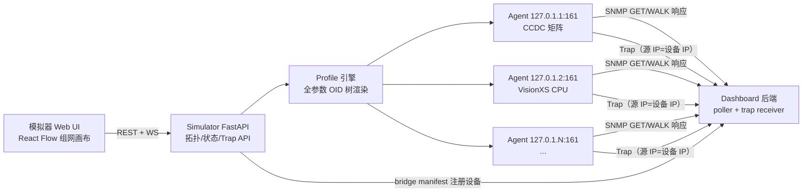

# KVM SNMP 模拟器改造计划
## 问题陈述
现有 `backend/simulator`（v2 包）只能加载 5 个硬编码场景，控制页是内嵌 HTML 按钮列表；仅 `ccdc_legacy` profile 暴露一小部分 CCDC 字段，其余 profile 只回身份 OID；端点状态只能改 status/video/display/frozen 四个字段；Trap 不区分来源设备。无法满足"像真有一个局域网的 G&D 设备群"的验收测试需求。
目标：把模拟器改造成一个可视化组网的本地模拟环境——拖拽设备、连线、配置端口后一键启动，每台设备是独立 SNMP Agent，暴露 MIB 定义的**全部**参数，运行中可任意修改任何状态字段（温度/电源/网口/键鼠/视频/SFP 等），并可选中设备发送指定 Trap。
## 现状关键事实
* 模拟器包：`backend/simulator/`（models.py 场景模型、state.py 线程安全状态、snmp_agent.py 每设备一个 UDP 线程 Agent、bridge.py 向 Dashboard 注册、main.py FastAPI + 内嵌控制页、scenarios.py 硬编码场景）。
* Dashboard 侧桥接：`backend/app/api/simulator.py` 接收 manifest 自动创建 `sim_{run}_{id}` 设备与端点，`host` 硬编码为 `127.0.0.1`、按 `snmp_port` 区分设备。
* MIB 权威字典（全参数的唯一依据）：
    * CCDC（legacy）：`backend/app/snmp/oid_map.py`（设备标量 + CPU 24 列 + CON 30 列 + portTable 5 列，实机校准）
    * CCDM/cc160：`H:\WORK\I\kvm\new\kvm-snmp-monitoring-docs\docs\devices\ccdm-controlcenter-digital.md`（204 个 OBJECT-TYPE：机框电源/RAID/风扇/网口/I/O 卡端口 + CPU/CON/DWC 表）
    * VisionXS：`.../visionxs-cpu-con.md`（CPU 28、CON 27 个可读变量）
    * DP1.2-MUX-ATC：`.../dp12-mux-atc.md`（身份/状态标量 + 4 张表 + error 对象；6 个可写对象**继续禁用 SET**）
    * Trap 正式布局 `.32828.2.1.0.{2,3,4}`；旧模拟器布局 `.32828.5.*` 仅作 legacy 兼容
* Dashboard 采集器目前仍是 CCDC 形状的（profile 化采集是另一计划，见 `docs/GD_MIB_COMPATIBILITY_AND_PROFILE_PLAN.md`）。本次改造让模拟器先具备全参数能力，可用 snmpwalk 独立验证；Dashboard 端暂只消费 CCDC 部分不变。
## 总体设计

### 1. 仿真局域网寻址（"像真机一样"）
* 每台模拟设备分配独立回环 IP（`127.0.1.x`），统一监听标准 **UDP 161**；Windows 无特权端口限制且 127/8 全网段可直接 bind，无需额外配置。
* Trap 发送 socket 绑定到设备自己的回环 IP，使 Dashboard 收到的 Trap 源 IP 与设备 IP 一致。
* 保留环境变量开关退回旧的"单 IP + 端口区分"模式（`SIM_ADDRESS_MODE=port`），兼容 Docker 场景。
* bridge manifest 增加 `host` 字段；`backend/app/api/simulator.py` 相应改为使用 manifest 的 host/port（去掉硬编码 `127.0.0.1`）。
### 2. Profile 全参数引擎（核心重构）
重写 `profiles.py` 为声明式数据字典：每个 profile 定义标量组和表（OID 根、列号、字段名、数据类型、枚举、默认值、单位、是否可在 UI 修改）。`snmp_agent.py` 的 `endpoint_oid_map()` 改为通用渲染器：`运行时状态 + profile 字典 → 完整 OID→值映射`。
覆盖范围：
* `ccdc_legacy`：`oid_map.py` 的全部设备标量（含序列号、MAC、电流、电压、fan1–6、双网口）+ CPU 表全 24 列 + CON 表全 30 列 + portTable 全 5 列。
* `ccdm_matrix`：按 ccdm 字典实现机框（双电源、RAID 状态、风扇、网口、I/O 卡与卡端口，含复合索引）+ CPU/CON/DWC 模块表。
* `visionxs_cpu` / `visionxs_con`：全部 28/27 个业务变量（温度、风扇、网络、视频、USB、显示、链路表）。
* `dp12_mux_atc`：身份/状态标量、cpuChannelTable、cpuChannelVideoTable、consoleVideoTable、fanTable、error 对象；`selectedChannel` 等可写对象只作为**状态字段在 UI 里改**，SNMP SET 仍拒绝。
每个字段在 `state.py` 运行时状态中都是可变的，UI 修改即时反映到下一次 SNMP 响应。保留 evidence 标记（vendor-backed / legacy-compatibility），路由继续标记 `simulation-declared`。
### 3. 拓扑编辑与运行控制 API（重写 main.py 为分模块 router）
* 拓扑 CRUD：`GET/POST/PUT/DELETE /api/v1/topologies`，拓扑 = 设备节点（类型/名称/IP/端口数）+ 端点模块（CPU/CON 挂在矩阵下，或独立 VisionXS 节点）+ 连线（端点↔矩阵端口、CPU↔CON 路由）+ 画布坐标。持久化为 JSON 文件存 `backend/simulator/topologies/`（现有 5 个内置场景转换为只读预置模板）。
* 运行控制：`POST /api/v1/topologies/{id}/start|stop`，start 时校验（IP/端口冲突、连线端口合法性）→ 为每台设备起 Agent → bridge 注册；stop 反向清理。
* 状态操控：通用 `PATCH /api/v1/runtime/devices/{id}/state`，接受按 profile 字典校验的字段路径补丁（如 `temperature=61.5`、`main_power=0`、`ports[3].status=down`、`endpoints[CPU-1-001].video_signal=0`、`con 的键鼠=none`）。状态转换按现有规则自动发 Trap（went offline/came online），其余字段变化可选附带 Trap。
* 设备级动作：断网（暂停 Agent，保留）、下电（Agent 停 + 主电源字段归零 + Trap）、恢复。
* Trap 控制台：`POST /api/v1/traps` 增强为：目标设备（单选/多选）、level、message；内置预设消息模板取自实机日志（`entered critical state: 'Offline'`、`SFP Rx power changed`、`Display connection state changed` 等）+ 自由文本；布局默认正式 `.32828.2.1.0.*`，可选 legacy `.32828.5.*` 用于回归。
* 新增 `WS /api/v1/ws`：向 UI 推送状态变更/事件流，替代当前 2 秒轮询。
### 4. 模拟器 Web UI（新前端子项目）
新建 `simulator-ui/`（React + Vite + `@xyflow/react`，独立于主 Dashboard 前端；构建产物由模拟器 FastAPI 静态托管，开发时 Vite 代理到 8888）。主 Dashboard 的"纯 SVG、不用第三方图库"约束是大屏渲染要求，模拟器是内部测试工具，用 React Flow 换取拖拽/连线开发效率是合理取舍。
页面结构：
* **组网画布**：左侧设备面板（CCDC 矩阵、CCDM 矩阵、VisionXS CPU、VisionXS CON、DP12 MUX、CPU 模块、CON 模块）拖入画布；矩阵节点显示端口锚点，模块拖到矩阵端口上连线；CPU→CON 画模拟路由（虚线，标注 simulation-declared）；保存/载入/另存为拓扑。
* **运行视图**：启动后同一画布切换为运行态，节点着色反映在线/离线/告警；点击节点打开**详情抽屉**——按 profile 字典分组列出该设备全部参数，可编辑字段就地修改（开关/下拉枚举/数字输入），立即 PATCH 生效。
* **Trap 面板**：勾选设备 → 选预设或输入自定义 level/message → 发送；显示发送历史。
* **事件流**：底部时间线显示 revision 事件与 Trap 发送记录（来自 WS）。
### 5. 验证
* 新增 `backend/tests/test_simulator_profiles.py`：对每个 profile 启动 Agent 后用 pysnmp 完整 WALK，断言 OID 集合与 profile 字典逐条一致（防止全参数覆盖回退）。
* 现有模拟器相关 pytest 回归通过；`python -m py_compile` 后端语法检查。
* 端到端手动验证：Dashboard 后端 + 模拟器 + Dashboard 前端三端联跑，验证 CCDC 设备被轮询、状态修改 1–2 秒内上屏（健康探测路径）、Trap 上屏且源 IP 正确。
* `simulator-ui`：`npm run build` + `npm run lint` 通过。
## 实施顺序
1. Profile 数据字典 + 运行时状态模型重构（`profiles.py`、`models.py`、`state.py`）
2. SNMP Agent 通用渲染器 + 回环 IP 寻址 + Trap 源 IP 绑定（`snmp_agent.py`）
3. 拓扑 CRUD / 运行控制 / 状态 PATCH / Trap API + WS（`main.py` 拆分为 routers）
4. bridge 与 Dashboard 侧 `app/api/simulator.py` 的 host 字段适配
5. `simulator-ui` React Flow 前端
6. 测试与端到端验证；更新 `backend/kvm_simulator_README.md`
## 边界与不做的事
* 不实现 SNMP SET（DP 可写对象只经模拟器自身 API 修改）。
* 不改 Dashboard 采集器的 profile 化（那是 `GD_MIB_COMPATIBILITY_AND_PROFILE_PLAN.md` 的范围）；CCDM/VisionXS/DP 的全参数本期通过 snmpwalk/测试验证，Dashboard 只继续消费 CCDC 形状数据。
* CPU→CON 路由仍是 simulation-declared 测试数据，UI 明确标注，不伪装成厂商路由发现。
* 旧单文件 `backend/kvm_simulator.py` 与 `run_simulators_large.py` 保留不动，README 中标记为 legacy。
