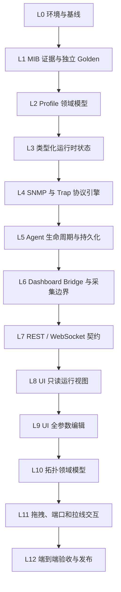

# KVM SNMP 模拟器自底向上开发计划

> 状态：开发规划
> 更新日期：2026-07-31
> 配套问题清单：`docs/simulator/PROBLEM_DISCOVERY_CHECKLIST.md`
> 目标：先完成可证明正确的 MIB、状态、协议和生命周期底座，再开发页面参数操作，最后开发端口级拖拽、拉线和拓扑交互。

## 1. 为什么必须分层

当前模拟器的主要问题不是缺少页面，而是多个下层契约尚未稳定：

- MIB Profile 仍有错误 OID、缺表和非法默认值；
- 状态 PATCH 可以写入错误类型或不影响 SNMP 的字段；
- Agent 会把编码异常表现为静默超时；
- 生命周期切换失败会破坏旧运行时；
- Dashboard 仍可能用 CCDC 计划轮询其他 Profile；
- API/WS 没有统一的活动拓扑和运行状态契约；
- UI 因此只能猜测后端状态和可编辑字段；
- 在此基础上直接开发拖拽、拉线，只会把错误继续放大到页面。

因此开发顺序固定为：



## 2. 逐层开发的硬规则

### 2.1 Gate 规则

每一层必须同时满足以下条件，才允许开始上一层正式开发：

1. 该层契约文档状态为 `Accepted`；
2. 代码实现完成；
3. 独立测试通过；
4. 失败路径和回滚测试通过；
5. 本层验证记录已写入仓库；
6. 问题清单中对应 P0/P1 已关闭；
7. 上一层文档明确列出它所依赖的本层文档和版本。

UI 原型可以提前用于讨论，但不得接入主运行链路、不得被标记为“完成”，也不得替代下层验收。

### 2.2 上层文档引用格式

每份上层设计文档必须包含：

```text
## 下层契约依赖
- L01_MIB_GOLDEN_CONTRACT.md / status=Accepted / commit=<sha>
- L02_PROFILE_MODEL_CONTRACT.md / status=Accepted / commit=<sha>

## 本层不得重新解释的事实
- OID、SYNTAX、MAX-ACCESS、INDEX 和 Trap 布局由 L1 决定
- 可写路径、类型、枚举和事务语义由 L3 决定
```

上层不得复制一份自己的 OID、字段枚举或状态规则。需要改变下层契约时，必须先修改下层文档和测试，再升级上层。

### 2.3 每层交付模板

每层至少交付：

- `docs/simulator/layers/Lxx_*.md`：本层契约；
- `docs/simulator/decisions/ADR-*.md`：需要取舍的架构决定；
- 代码和数据迁移；
- 独立单元/协议/集成测试；
- `docs/simulator/verification/Lxx_*.md`：验证命令、环境、结果和未验证边界；
- 问题清单状态更新；
- README/启动说明的相应更新。

## 3. 当前实现盘点

| 层 | 当前已有 | 可以保留 | 必须重做或补齐 |
|---|---|---|---|
| L0 | README、启动指南、pytest、Vite | 基本命令结构 | PowerShell/CMD 分离、配置检查、验收基线 |
| L1 | MIB 差异台账、设备字典 | CCDM/VisionXS/DP 证据快照 | 独立机器可读 golden、legacy Trap fixture、CCDC 证据边界 |
| L2 | `PROFILE_DEFINITIONS` | 声明式方向 | 公共字段误复用、缺表、值域、optional/instance 分离 |
| L3 | `ScenarioState`、revision、working copy | 锁、snapshot、多 patch 工作副本 | 类型化值、路径注册、结构字段保护、差异事件 |
| L4 | UDP Agent、GET/GETBULK、Trap sender | 每设备 Agent、基本正式 Trap | 缓存、错误可见性、协议边界、真实 UDP golden |
| L5 | start/stop/action、TopologyStore | ready 等待、power off/restart | prepare/commit/rollback、lease cleanup、原子 JSON |
| L6 | bridge session/epoch/manifest | session 防旧请求覆盖 | poll_mode、Profile 边界、Trap 身份、stop cleanup |
| L7 | REST/WS 原型 | 大部分 endpoint 形状 | `/status`、错误模型、统一 snapshot/revision |
| L8 | React Flow 页面骨架 | 视觉框架、事件时间线 | 后端事实源、活动拓扑同步、健康状态 |
| L9 | 详情抽屉原型 | 表单组件方向 | metadata 契约、实例字段、虚拟化、提交结果 |
| L10 | devices/endpoints/edges schema | 基本引用检查 | 端口语义、全局 ID、物理边/模拟路由、持久化版本 |
| L11 | React Flow 节点和通用 Handle | 画布库 | 模块挂载、端口 Handle、合法连线、无损保存 |
| L12 | 24 项后端测试、build/lint | 基础回归 | 独立 MIB、真实浏览器、故障注入和发布矩阵 |

## 4. 分层实施计划

## L0：冻结当前基线与运行环境

### 目标

先让所有人能以同样方式启动、复现和判断成功/失败，避免后续每层都在不同环境中争论。

### 实现范围

- 记录当前工作区基线、分支和未提交文件；
- 把现有复现问题固化成测试或验证脚本；
- 分开编写 PowerShell、CMD、Docker 启动方法；
- 增加只读配置检查命令；
- 规定测试数据库、端口和日志目录；
- 配置打印时隐藏 token/community；
- 定义统一的 smoke test。

### 必须先写的文档

- `layers/L00_BASELINE_AND_ENVIRONMENT.md`
- `verification/L00_CURRENT_REPRODUCTIONS.md`
- `decisions/ADR-001-LOCAL_ADDRESS_MODES.md`

### 测试与验收

- PowerShell 启动 Dashboard、Simulator 和 UI；
- CMD 启动同一组合；
- build 后托管和 Vite dev 两种 UI 模式；
- 验证 `/health`、Simulator `/status`、活动拓扑、Agent 数量、bridge 绑定数、Trap 端口；
- 端口占用时给出明确错误。

### Gate L0

- 新人仅按文档能启动五 Profile；
- 不读取源码也能判断哪个环节失败；
- SIM-ENV-001、SIM-ENV-002 关闭。

当前状态（2026-07-31）：`Accepted for Windows local port mode`。验收证据见
`verification/L00_CURRENT_REPRODUCTIONS.md`。Docker Simulator 网络身份和
Dashboard run 自动清理不在本次 Accepted 范围。

### 预计工作量

1–2 工程日。

## L1：建立 MIB 证据和独立 Golden Manifest

### 目标

建立不依赖模拟器实现的协议事实源。此层只回答“厂家对象是什么”，不回答 UI 怎么展示。

### 实现范围

- 为 CCDM、VisionXS CPU、VisionXS CON、DP12 建机器可读 manifest；
- CCDC 单独标记 `legacy-unverified`，不得从 CCDM 推导；
- 每个对象记录：
  - 数值 OID 模板；
  - scalar/table/entry/index/column；
  - SYNTAX；
  - MAX-ACCESS；
  - enum/range/unit；
  - INDEX 顺序；
  - optional group；
  - 来源文档和原始 MIB 行号；
- 单独建立 formal Trap 和 legacy capture fixture；
- 明确“对象定义”“索引范围”“fixture 实际行”三者的区别。

### 数据建议

```text
backend/tests/golden/simulator/
  ccdm.objects.json
  visionxs_cpu.objects.json
  visionxs_con.objects.json
  dp12_mux_atc.objects.json
  ccdc_legacy.objects.json
  trap_formal.json
  trap_legacy_dashboard_v1.json
```

Golden 文件不能由 `PROFILE_DEFINITIONS` 生成。

### 必须先写的文档

- `layers/L01_MIB_GOLDEN_CONTRACT.md`
- `layers/L01_TRAP_EVIDENCE_CONTRACT.md`
- `verification/L01_MIB_COVERAGE_REPORT.md`

### 测试与验收

- OID 唯一；
- 表列号唯一；
- enum 默认值合法；
- scalar 必须有 `.0` 实例规则；
- not-accessible 对象不进入可 GET manifest；
- 复合索引顺序固定；
- CCDM 20 张表覆盖；
- Trap notification 和变量分别断言。

### Gate L1

- SIM-MIB-001 至 SIM-MIB-005、SIM-TRAP-002/003 的事实部分关闭；
- 任一 Profile 的对象集合可以在不导入模拟器代码的情况下审查。

当前状态（2026-07-31）：
`Accepted for local curated device dictionary snapshot`。五份 object manifest、
两份 Trap fixture、L1 专项 27 项及全回归 69 项已通过；当前 Profile drift
单独记录在 `verification/L01_PROFILE_DRIFT.json`，其中 CCDM 的 L2 待修差异
为 15/20 表、134/142 叶、缺 11、多 3、非法默认值 4。该结论不表示本轮重新
核验过原始 MIB 或现场设备。

### 预计工作量

4–7 工程日。

## L2：重建 Profile 领域模型

### 目标

把 L1 证据变成可靠、可版本化的 Profile 定义，但仍不处理运行时状态和网络协议。

### 实现范围

- 定义 `ScalarDef`、`TableDef`、`ColumnDef`、`IndexDef`、`EnumDef`；
- Profile 绑定精确 sysObjectID、证据状态和版本；
- 区分：
  - 厂家对象名；
  - 内部规范字段名；
  - UI label；
- 区分 object definition 和 fixture instance；
- optional group 不默认生成；
- 取消不安全的跨产品 `COMMON_SCALARS` 事实复用；
- Profile metadata 只描述 schema，不展开数千个实例字段。

### 必须先写的文档

- `layers/L02_PROFILE_MODEL_CONTRACT.md`
- `decisions/ADR-002-PROFILE-NAMING-AND-VERSIONING.md`
- `decisions/ADR-003-OPTIONAL-GROUP-AND-FIXTURE-ROWS.md`

文档必须引用 L1 golden 和证据版本。

### 测试与验收

- Profile → object manifest 与 L1 golden 完全匹配；
- 不允许重复 `(base_oid, column)`；
- 不允许非法默认值；
- 每个 Profile 的 fixture 行由显式配置产生；
- metadata 大小和生成时间有预算。

### Gate L2

- Profile 代码可以被 L3 状态层消费；
- Profile 自身不包含 UI 或 socket 逻辑；
- SIM-STATE-003、SIM-UI-003 的 schema 根因关闭。

当前状态（2026-07-31）：
`Candidate / technical verification passed / Git baseline pending`。五个 typed
Profile 已与 L1 Golden 做全字段投影，CCDM 为 20 表/142 个可读叶；默认
fixture 已独立为静态显式工件，optional 默认关闭，metadata 不展开实例；
后端全回归 99 项通过。证据见
`verification/L02_PROFILE_MODEL_REPORT.md` 和
`verification/L02_PROFILE_CATALOG_DRIFT.json`。

L0/L1/L2 工件目前仍未形成可审计 Git commit，不能填写真实
`commit=<sha>`，所以 L2 尚未 `Accepted`，不得开始 L3 正式开发。

### 预计工作量

3–5 工程日。

## L3：类型化运行时状态与原子 PATCH

### 目标

建立唯一、类型安全、线程安全的模拟状态源。此层不启动 UDP Agent。

### 实现范围

- 从 Profile schema 实例化设备状态；
- 为 scalar、单索引表、复合索引表建立规范实例键；
- 生成只读/可修改路径索引；
- 值验证覆盖类型、枚举、范围、长度和 optional 能力；
- 禁止修改 id/index/row/profile/host/system_oid 等结构字段；
- 所有 patch 先验证完整 batch，再原子提交；
- revision、event 和 changed paths 一次提交；
- reset、disconnect、power_off、restore 采用同一状态转换模型；
- 提供 `renderable_snapshot()`，但不做 ASN.1 编码。

### 必须先写的文档

- `layers/L03_RUNTIME_STATE_CONTRACT.md`
- `layers/L03_PATCH_PATH_AND_TRANSACTION_CONTRACT.md`
- `decisions/ADR-004-STATE-KEYS-AND-COMPOSITE-INDEXES.md`

### 测试与验收

- 合法 patch 更新准确字段；
- 非法类型、enum、range、路径、结构字段全部拒绝；
- 任意失败后 state/revision/events/render snapshot 不变；
- Hypothesis/property test 覆盖随机 patch；
- 并发读取和 patch 不产生半状态；
- action 状态机有完整转移表。

### Gate L3

- SIM-STATE-001/002/003 关闭；
- 上层只能通过 L3 API 修改状态，不能操作内部 dict。

### 预计工作量

4–6 工程日。

## L4：纯协议渲染、SNMP Agent 与 Trap

### 目标

在 L1/L2/L3 已稳定的前提下，让真实 UDP 协议行为可证明正确。

### 实现范围

- `state snapshot + profile -> immutable OID snapshot`；
- OID snapshot 按 device revision 缓存；
- 正确编码 ObjectIdentifier、Integer32、Gauge、Counter、TimeTicks、OctetString；
- GET、GETNEXT、GETBULK、EndOfMibView；
- SNMP SET 统一返回 notWritable，DP 也不例外；
- 未知 PDU 明确拒绝；
- Agent 错误进入结构化状态和日志；
- formal Trap 严格按厂家 MIB；
- legacy Trap 严格按独立 capture fixture；
- Trap sender 失败必须可见。

### 必须先写的文档

- `layers/L04_SNMP_PROTOCOL_CONTRACT.md`
- `layers/L04_TRAP_ENCODING_CONTRACT.md`
- `verification/L04_REAL_UDP_MATRIX.md`

### 测试与验收

- 每 Profile 启动真实 UDP Agent；
- 对独立 golden 做 GET/WALK；
- 多 root、多 repeater GETBULK；
- `nonRepeaters=0/N/负值/超量`；
- EndOfMibView；
- unknown OID 的 NoSuchObject/NoSuchInstance；
- SET notWritable；
- 非法状态不应进入 Agent；注入编码错误时 health 显示 error；
- formal/legacy 原始 BER 捕获断言；
- 并发 GET 和完整 WALK 性能预算。

### Gate L4

- SIM-SNMP-001/002、SIM-TRAP-003 协议部分关闭；
- 只有真实 UDP 测试通过，才能进入 Agent 生命周期开发。

### 预计工作量

4–7 工程日。

## L5：Agent Supervisor、生命周期与持久化

### 目标

让 start、switch、stop、power off、restore 和进程退出具备可恢复的事务语义。

### 实现范围

- 定义运行状态机：
  - stopped；
  - preparing；
  - running；
  - degraded；
  - stopping；
  - failed；
- Agent 提供 ready/error/stop 完成信号；
- topology start 使用 prepare → ready → commit；
- topology switch 失败保留旧 runtime；
- power_off/restore 失败有回滚；
- 端口 reservation 和实际 bind 使用同一策略；
- TopologyStore 原子写、版本和并发锁；
- 禁止删除 active topology；
- 正常退出和异常退出的 lease/cleanup 语义。

### 必须先写的文档

- `layers/L05_RUNTIME_LIFECYCLE_STATE_MACHINE.md`
- `layers/L05_TOPOLOGY_STORE_CONTRACT.md`
- `decisions/ADR-005-ATOMIC-TOPOLOGY-SWITCH.md`
- `decisions/ADR-006-RUNTIME-LEASE-AND-CLEANUP.md`

### 测试与验收

- 首台/中间/最后一台 Agent 启动失败；
- 端口被占用和 bind 后线程异常；
- 已运行拓扑切换失败；
- restore bind 失败；
- stop 后 `/state` 返回未运行状态、SNMP 无响应；
- JSON 中途写失败、并发更新、损坏文件；
- 进程退出无孤立 Agent。

### Gate L5

- SIM-LIFE-001/002、SIM-STORE-001/002 关闭；
- Runtime supervisor 成为唯一生命周期入口。

### 预计工作量

4–6 工程日。

## L6：Dashboard Bridge、采集边界与 Trap 身份

### 目标

让 Simulator 与 Dashboard 之间的设备注册、轮询、Trap 和清理边界准确，不把非 CCDC 数据套入 CCDC 模型。

### 实现范围

- manifest 增加：
  - profile_id/version；
  - poll_mode；
  - capabilities；
  - fixture evidence；
- Dashboard 仅按 poll_mode 执行批准的计划；
- non-CCDC 在 Profile poller 完成前只做 identity/health 或完全禁用 rich poll；
- session lease、heartbeat、stop cleanup；
- 旧 session、旧 revision 和崩溃 run 回收；
- 形成 port/loopback Trap 身份 ADR；
- generic Trap 多设备同 host 不得调用单结果查询；
- 保存 raw level/message/snmpTrapOID/source/all varbind；
- 平台 severity 映射与厂家 raw level 分离。

### 必须先写的文档

- `layers/L06_BRIDGE_MANIFEST_CONTRACT.md`
- `layers/L06_DASHBOARD_POLL_BOUNDARY.md`
- `layers/L06_TRAP_IDENTITY_AND_ATTRIBUTION.md`
- `decisions/ADR-007-PORT-MODE-TRAP-IDENTITY.md`

### 测试与验收

- 五 Profile 注册和清理；
- CCDC 执行批准的 CCDC plan；
- CCDM/VisionXS/DP 不收到 CCDC rich poll；
- 同 host 多设备的 Trap 归属；
- session takeover、stale revision、正常 stop、崩溃 lease 超时；
- Dashboard 重启后的重新同步。

### Gate L6

- SIM-DASH-001、SIM-TRAP-001/002、SIM-LIFE-002 集成部分关闭；
- Dashboard 不再产生 Profile 交叉污染。

### 预计工作量

4–7 工程日。

## L7：稳定 REST 与 WebSocket 契约

### 目标

在没有 Simulator UI 的情况下，API 已经是完整、可操作、可诊断的产品接口。

### 实现范围

- `/api/v1/status`：
  - active topology；
  - runtime state；
  - Agent health；
  - bridge health；
  - Trap target；
  - latest error；
- 统一错误模型和状态码；
- OpenAPI 固化 topology、patch、action、trap、status；
- WS 统一为：
  - snapshot；或
  - event + revision，客户端必须 refetch；
- 所有事件携带 event_id、revision、timestamp；
- reconnect 后从 server snapshot 恢复，不依赖浏览器旧状态；
- API 认证、host allowlist 和 WS Origin 策略。

### 必须先写的文档

- `layers/L07_REST_API_CONTRACT.md`
- `layers/L07_WEBSOCKET_EVENT_CONTRACT.md`
- `layers/L07_ERROR_MODEL.md`
- `decisions/ADR-008-WS-SNAPSHOT-VS-REFETCH.md`

### 测试与验收

- UI 当前将发送的 payload 成为正式 contract fixture；
- 双客户端同步 start/stop/reset/patch/action/trap/CRUD；
- 断线重连和 revision 跳跃；
- 预期冲突不得返回 500；
- 未认证和非法 Origin 测试。

### Gate L7

- SIM-API-001、SIM-WS-001、SIM-SEC-001 关闭；
- curl/httpx/WebSocket client 可以完成全部运行操作。

### 预计工作量

3–5 工程日。

## L8：Simulator UI 只读运行视图

### 目标

先让页面准确反映后端事实，不做参数编辑和拓扑编辑。

### 实现范围

- 页面从 `/status` 初始化；
- 显示 active topology、running、revision；
- 显示每设备 Agent/bridge/Trap 状态；
- Start/Stop 使用 server-reported topology；
- WS 更新或 revision refetch；
- 明确显示 Profile evidence；
- 错误和 degraded 状态可见；
- 刷新和第二浏览器无状态漂移。

### 必须先写的文档

- `layers/L08_UI_RUNTIME_STATE_MODEL.md`
- `layers/L08_UI_STATUS_AND_ERROR_PRESENTATION.md`

文档必须引用 L7 API/WS 契约，不得在 UI 重新推断运行状态。

### 测试与验收

- backend 已运行 all-profiles 时首屏显示 Running/all-profiles；
- 首次 Stop 成功；
- 第二浏览器同步；
- bridge 失败、Agent 失败、Trap 失败均有明确展示；
- Playwright 浏览器测试。

### Gate L8

- SIM-UI-002、SIM-OBS-001 的页面部分关闭；
- 页面只读状态准确后，才允许开发参数表单。

### 预计工作量

3–5 工程日。

## L9：实例化全参数查看与编辑

### 目标

页面只显示当前 fixture 实际存在、由 L2/L3 允许编辑的字段，并保证提交后状态与 SNMP 一致。

### 实现范围

- metadata 由 Profile schema + runtime instances 共同生成；
- scalar、单索引表、复合索引表分组；
- raw value、enum label、unit、evidence 同时展示；
- read-only 字段不可编辑；
- 数字、enum、boolean、string 使用类型化控件；
- 大表使用搜索、分页或虚拟列表；
- 保存等待服务器确认，不做假成功；
- 失败显示字段级错误；
- 成功后按 revision 更新。

### 必须先写的文档

- `layers/L09_UI_FIELD_METADATA_CONTRACT.md`
- `layers/L09_UI_PARAMETER_INTERACTION.md`
- `decisions/ADR-009-LARGE-PROFILE-VIRTUALIZATION.md`

### 测试与验收

- 五 Profile 各至少一个 scalar、单索引表和复合索引表；
- 类型、枚举、范围和 read-only；
- PATCH 成功后 GET API 和 SNMP GET 都返回新值；
- PATCH 失败后 UI、state、revision、SNMP 均不变；
- CCDM 大数据量性能测试；
- 无 fallback 未声明字段。

### Gate L9

- SIM-UI-001/003 关闭；
- “全参数”必须以 L1 manifest 覆盖率报告为依据。

### 预计工作量

4–7 工程日。

## L10：拓扑领域模型与验证器

### 目标

先定义“什么是合法 KVM 模拟拓扑”，再开发拖拽和拉线。

### 实现范围

- 实体类型：
  - matrix device；
  - standalone device；
  - matrix CPU module；
  - matrix CON module；
  - DWC；
  - physical port；
  - DP channel；
- 全局稳定 ID；
- parent/slot/port/index 关系；
- edge 类型：
  - physical attachment；
  - device link；
  - simulation-declared route；
- 端口方向、容量、重复占用、自环和跨类型规则；
- VisionXS 独立设备不得伪装成矩阵模块；
- physical fact 与模拟业务 route 分离；
- schema 版本与迁移；
- TopologyStore 无损 round trip。

### 必须先写的文档

- `layers/L10_TOPOLOGY_DOMAIN_CONTRACT.md`
- `layers/L10_PORT_AND_EDGE_VALIDATION.md`
- `layers/L10_TOPOLOGY_PERSISTENCE_VERSIONING.md`
- `decisions/ADR-010-PHYSICAL-LINK-VS-SIMULATED-ROUTE.md`

### 测试与验收

- 合法矩阵模块挂载；
- 非法端口、错误方向、重复占用、自环、跨设备错误；
- 重复 endpoint ID；
- CPU→CON route；
- 保存、加载、启动、停止、重载无损；
- schema migration fixture。

### Gate L10

- SIM-TOPO-003 和拓扑存储问题关闭；
- 后端 validator 可以独立于 UI 判定所有连线。

### 预计工作量

4–6 工程日。

## L11：拓扑画布、拖拽、端口和拉线交互

### 目标

最后把 L10 的合法拓扑能力映射到 React Flow，不在前端发明新的拓扑语义。

### 实现范围

- Palette 区分整机、独立端点和矩阵模块；
- 模块拖入矩阵或选择父设备/槽位；
- 每个可连接端口有独立 Handle；
- physical link 与 simulation route 使用不同样式；
- 连线前客户端预校验，保存时后端最终校验；
- 非法连接给出具体原因；
- Save/Save As/version conflict；
- 启动态禁止不安全编辑，或使用明确的 staged change；
- 删除节点时显示受影响的端口、路由和 runtime；
- 画布布局数据与协议状态分离。

### 必须先写的文档

- `layers/L11_TOPOLOGY_EDITOR_INTERACTION.md`
- `layers/L11_NODE_AND_EDGE_VISUAL_MAPPING.md`
- `layers/L11_EDITING_AND_RUNTIME_BOUNDARY.md`

### 测试与验收

- Playwright 拖入设备、挂载模块、选择端口、拉线、保存、重载；
- endpoint-to-endpoint route 不丢失；
- 后端 422/409 在画布定位到具体边或节点；
- preset 只读和 Save As；
- 两浏览器版本冲突；
- 运行态编辑边界。

### Gate L11

- SIM-TOPO-001/002 关闭；
- 页面拓扑与后端持久化、runtime snapshot 完全一致。

### 预计工作量

5–8 工程日。

## L12：端到端验收、文档和发布

### 目标

证明整个系统不仅“能打开”，而且在成功、失败、恢复和并发场景下都符合已接受契约。

### 验收矩阵

#### 协议

- 五 Profile 独立 golden；
- GET/GETNEXT/GETBULK/WALK/SET；
- formal/legacy Trap；
- port/loopback；
- 并发与性能。

#### 生命周期

- 冷启动；
- topology switch；
- 端口冲突；
- 中途 Agent 失败；
- power off/restore；
- stop；
- Simulator 崩溃；
- Dashboard 重启；
- session takeover。

#### API/WS/UI

- curl/httpx contract；
- 双 WS 客户端；
- Playwright 参数编辑；
- Playwright 拓扑拖拽/拉线；
- 大型 CCDM 页面；
- 错误呈现。

#### Dashboard

- 五设备注册；
- CCDC 端到端轮询；
- non-CCDC 采集边界；
- Trap 归属；
- stop/lease cleanup；
- 无残留设备。

#### 环境

- Windows PowerShell；
- Windows CMD；
- build 后静态托管；
- Vite dev；
- Docker；
- 端口占用和防火墙说明。

### 必须写的文档

- `verification/L12_END_TO_END_ACCEPTANCE.md`
- `verification/L12_FAILURE_INJECTION_REPORT.md`
- `SIMULATOR_OPERATIONS_RUNBOOK.md`
- `SIMULATOR_RELEASE_CHECKLIST.md`

### 发布 Gate

- 所有 P0/P1 关闭；
- P2 有明确接受人和后续计划；
- 真实 UDP、浏览器和 Dashboard E2E 全部通过；
- 未执行测试不得写“通过”；
- CCDC 未获厂家 MIB/实机证据前继续标记 `legacy-unverified`；
- 静态 MIB 正确不等于实机兼容，发布说明保留现场验证边界。

### 预计工作量

3–5 工程日。

## 5. 推荐里程碑

| 里程碑 | 包含层 | 可以对外宣称的能力 | 预计累计工作量 |
|---|---|---|---:|
| M1 协议底座可信 | L0–L2 | Profile 对象定义可审计，但尚不启动正式 UI | 8–14 日 |
| M2 本地 Agent 可信 | L3–L5 | 状态、SNMP、Trap、生命周期可通过 API/脚本验收 | 20–33 日 |
| M3 Dashboard 联调可信 | L6–L7 | 注册、采集边界、清理、API/WS 可验收 | 27–45 日 |
| M4 参数控制台可用 | L8–L9 | 页面准确查看和修改全参数 | 34–57 日 |
| M5 可视化组网可用 | L10–L11 | 端口级拖拽、挂载、拉线、保存和运行 | 43–71 日 |
| M6 发布候选 | L12 | 全链路、失败恢复和环境矩阵通过 | 46–76 日 |

估算为单人连续工程日，不包含厂家补件、现场设备等待和 Dashboard 多 Profile 生产采集器的完整重构。可并行的工作仅限于不共享契约的验证或文档整理；不得并行修改尚未 Accepted 的上下层契约。

## 6. 建议的提交与分支策略

每层使用独立分支和提交组，避免一次提交混合 MIB、状态、协议和 UI：

```text
codex/simulator-l00-baseline
codex/simulator-l01-mib-golden
codex/simulator-l02-profile-model
...
codex/simulator-l11-topology-editor
```

每层至少分为：

1. 文档与 golden 基线；
2. 实现；
3. 测试与验证证据；
4. README/运行手册更新。

不建议在当前大量未提交修改上继续叠加 L1–L11。开始实施前应先决定：

- 将当前改造作为只读参考并建立干净基线；或
- 先把当前工作区按“文档、后端、UI、测试”拆成可审查提交。

不得用 destructive reset 丢弃当前工作。

## 7. 第一轮建议任务

第一轮只做 L0 和 L1，不进入业务 UI。L0 与 L1 已按各自限定范围通过 Gate：

1. 已完成：修订 CMD/PowerShell 启动文档；
2. 已完成：落地只读 `/status`、doctor 和 smoke；
3. 已完成：固化真实 UDP GET、端口故障、Bridge/Trap 和清理验证；
4. 已完成：建立五 Profile golden schema；
5. 已完成：建立 CCDM 202 对象、20 表独立 Golden；
6. 已完成：用 Golden 明确输出 CCDM Profile drift；
7. 已完成：L1 独立 Gate 审计；下一步准备 L2 Profile 重建。

第一轮结束时，页面外观不会增加功能，但项目会第一次拥有可靠的“厂家事实底座”和可重复验收基线。这是后续状态、Agent、API 和页面不再反复返工的前提。
