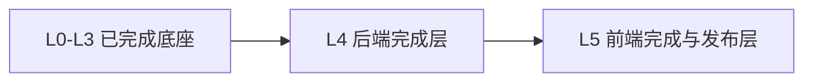

# KVM SNMP Simulator 后续两层收敛计划

> 状态：Active plan
> 日期：2026-07-31
> 前置 Gate：L0–L3 Accepted；L3 baseline `91e5ffb4dd69`
> 取代范围：原 `LAYERED_DEVELOPMENT_PLAN.md` 中 L4–L12 的九个开发阶段

## 1. 决策

L0–L3 继续作为已经完成的底层事实和状态契约，不返工、不复制。后续只保留
两个正式交付层：

原 L4–L7 合并为新的 L4；原 L8–L12 合并为新的 L5。旧计划中的细节继续
作为检查清单，但不再分别立项、分别等待九次 Gate。

## 2. 为什么可以收敛

已经稳定并可复用的底座包括：

- L1 独立 MIB/Trap Golden；
- L2 五个 typed Profile 和显式 fixture；
- L3 canonical path、strict value validation、atomic batch、revision/event；
- Windows 本地启动、doctor/smoke 和基础 UDP/Bridge/Trap 测试。

剩余问题已经不是九个互不相关的架构研究，而是两个完整产品交付：先把后端
协议、生命周期、集成和 API 一次做通，再把页面、参数编辑、组网和发布一次
做通。

## 3. L4：后端完成层

目标：Simulator 不依赖前端也能通过 API、脚本和真实 UDP 完成全部模拟操作，
且状态、SNMP、Trap、Agent、Bridge、REST 和 WebSocket 使用同一 revision
真值。

L4 内部有四个工作流，但只有一个最终 Gate：

1. 协议：OID snapshot、ASN.1、GET/GETNEXT/GETBULK、Trap、SET 拒绝；
2. 生命周期：start/switch/stop/power_off/restore、ready、rollback、store；
3. Dashboard 集成：Profile/poll mode、manifest、Trap 身份、session/cleanup；
4. 产品 API：OpenAPI、统一错误、revision 冲突、WS 重连、安全和诊断。

正式任务和参考文件见
`layers/L04_BACKEND_COMPLETION_TASK_MANUAL.md`。L4 完成后必须产生：

- Accepted 后端任务手册；
- 冻结的 `api/SIMULATOR_API_V1_CONTRACT.md`；
- `verification/L04_BACKEND_COMPLETION_REPORT.md`；
- 后端代码、测试、启动文档和真实 Git commit。

## 4. L5：前端完成与发布层

目标：在 Accepted L4 API 上完成一个可直接使用的 Simulator 控制台，包括
运行状态、全参数、Trap、拓扑建模、端口级拉线、保存/运行和端到端发布。

L5 内部按页面流推进，不再拆成新的层级：

1. 运行总览和实时连接；
2. Profile/fixture 驱动的全参数查看与编辑；
3. 设备、模块、端口、物理边和 simulation route 建模；
4. 拖拽、挂载、拉线、校验、保存、启动和错误恢复；
5. 浏览器 E2E、构建、部署、使用手册和发布验收。

正式任务和参考文件见
`layers/L05_FRONTEND_COMPLETION_TASK_MANUAL.md`。L5 完成即形成发布候选，不再
增加 L6、L7 等新层。

## 5. 并行规则

前端现在可以开始页面布局、组件、只读视图和基于 contract fixture 的开发；
后端可以同时实现 L4。但有两个硬边界：

- 前端不得依据当前临时实现猜测字段、OID、枚举或可写性；
- 写操作、拓扑保存和 WS 重连只能在对应 API contract fixture 通过后接入。

后端每冻结一组 API fixture，前端即可接入该组，不必等待整个 L4 最后一日。
这叫按垂直功能片交付，不是重新增加层级。

## 6. 最终 Gate

### L4 Gate

- 独立 Golden 驱动的真实 UDP GET/WALK/GETBULK 和 Trap 捕获通过；
- API patch 后 GET API、WS 和 SNMP 读取同一 committed value/revision；
- start/switch/stop/power_off/restore 故障注入无半状态和端口泄漏；
- Dashboard 对五 Profile 不套用错误 CCDC 采集计划；
- OpenAPI、错误模型、WS 事件和安全边界冻结；
- 后端 P0/P1 为 0。

### L5 Gate

- 页面只展示服务器报告的实际实例和可写路径；
- 参数编辑成功/失败与 API、WS、SNMP 一致；
- 拓扑 round trip 无损，非法连线在保存前和服务器端都拒绝；
- 双浏览器、断线重连、revision gap 和冲突处理通过；
- Windows 启动、构建、浏览器 E2E、Dashboard 联调和发布文档通过；
- 全项目 P0/P1 为 0。

## 7. 时间盒

不再使用原计划 46–76 工程日的逐层累计估算。新的执行方式是：

- L4 后端完成层：一个连续开发阶段，按四个工作流并行收口；
- L5 前端完成层：一个连续开发阶段，可在 L4 API fixture 冻结后滚动接入；
- 每层只做一次独立 Gate 和一次 Accepted 提交。

若出现厂家资料或现场设备缺失，记录为明确外部边界，不再因此继续拆层。
